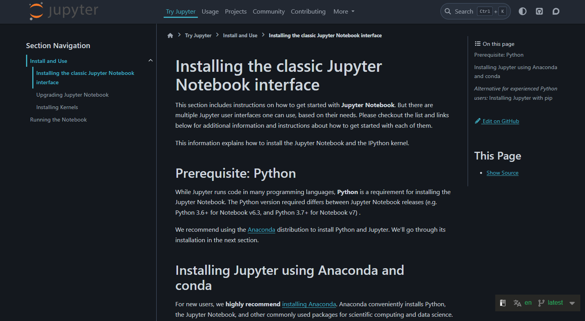

### Предыстория
[//]: <Бизнес-кейс: как большая зеленая компания потеряла 89,5 млрд рублей, потому что поздно вспомнила про документацию>

Бизнес-кейс:

Большая зеленая компания VS Маленькая синяя компания

### Об авторе

* Мелешко Александр Станиславович

* 15 лет опыта техписателем, переводчиком, редактором

* Две опубликованных книги

* Открыл (и через год закрыл) своё агентство по переводу игр

* Руковожу небольшим отделом техписателей в большой компании

* Любимая игра: Crusader Kings 3

### О старом курсе
[//]: <Худший курс за историю ITHub>

* Самый душный курс каждый семестр, когда преподавался

* Особенности контента

* Особенности постановки задач

### Я буду учить:
[//]: <Лучший курс за историю ITHub>

* Писать как можно меньше документации

* Отбиваться от хотелок заказчика

* Как можно меньше контактировать с конечным пользователем

* Никогда больше не ходить на бесполезные созвоны в 9 утра

* Четко пояснять, почему "нет, быстрее не получится"

### План курса
[//]: <Через 4 месяца вы положите себе в портфолио вот такую здоровскую штуку>


### Возможный результат



### Что такое техническая документация и зачем она нужна
[//]: <Официальное понятие. Понятие на практике. Документация и коммуникация.>

**???**

### Что такое техническая документация и зачем она нужна
[//]: <Официальное понятие. Понятие на практике. Документация и коммуникация.>

* *Описание аспектов разработки, устройства и использования продукта*

* *Канал коммуникации между участниками процесса разработки и использования продукта*

### Хорошо, зачем *мне* она нужна?
[//]: <Привлечение пользователя, последователя, покупателя. *И все равно каждый десятый в этом зале станет техническим писателем.*>

* Привлечение пользователя

* Совместная работа

* Реклама продукта

* Отбиться и сослаться

### Но ведь есть ChatGPT!

Плюсы:
**???**

Минусы:
**???**

### Но ведь есть ChatGPT!
[//]: <Преимущества, риски, закон, перспективы, престиж и репутация. Документирование API как пример победы ИИ. Правила использования ИИ в рамках курса.>

* Плюсы
* * Автоматизация документирования (API, шаблоны, Docs-as-Code)
* * Вычитка и тестирование (Агенты)
* * Стандартизация
* Минусы
* * Не всегда законно
* * Машинные косяки очевидны
* * Ломается на больших объемах
* * Средняя температура по больнице

### Правила использования ИИ

1. Понимайте задачу
2. Указывайте модель (DeepSeek, ChatGPT, Command-R, etc.)
3. Имейте в виду ограничения
4. Попробуйте сначала руками, у нас всего ~12 пар

### Роль документации в ИТ-проектах
[//]: <Договориться, спланировать, сослаться, прикрыться>

* Договориться
* Спланировать
* Сослаться
* Прикрыться

### Участники процесса документирования
[//]: <Продажники vs Заказчики vs Начальники vs Вы>

* Продажники
* Заказчики
* Начальники
* Вы

### Три кита технической документации
[//]: <Кому, зачем и как?>

* Кому? (Аудитория)

* Зачем? (Задача)

* Как? (Контекст)

### Условности с платформой

* Старые материалы остаются

* **Старые задачи остаются**

* Новые материалы (эта презентация) и новые задания добавляются ссылкой в конец урока на платформе

* Старые задания выполнять можно, но оцениваться они не будут

### Задание: «Знакомство с Git» [3 балла]
[//]: <Завести аккаунт для проекта и загрузить пустой файл. Записать каждый шаг.>

Завести аккаунт, создать репозиторий и загрузить пустой файл. Записать каждый шаг. Открыть репозиторий для внешнего доступа.

**Структура**:
```
github.com/имя_пользователя/имя_репозитория/имя_файла.txt
```
**В txt:**
```
Имя Фамилия
Группа
почта@spb.ithub.ru
```

**Deliverables:**
Cсылка в виде `github.com/имя_пользователя/имя_репозитория/` в поле ответа на платформе.